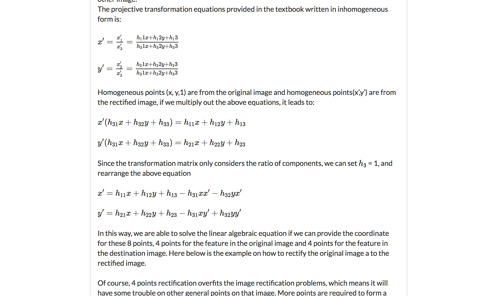

## Introduction
This is the Blog Content Management Site in Node.js + MongoDB. Pagination is added to handle large volume of blogs and login/logout authorization are added as well as comments.

## Feature Description 
This is the screenshot for home pages to display all the blog content it has and some basic information. Here, the pagination is also used to go over pages one by page.

The format is preserved, so user can copy&past from word document and line break is preserved. Also, math formula can be displayed in the post.

