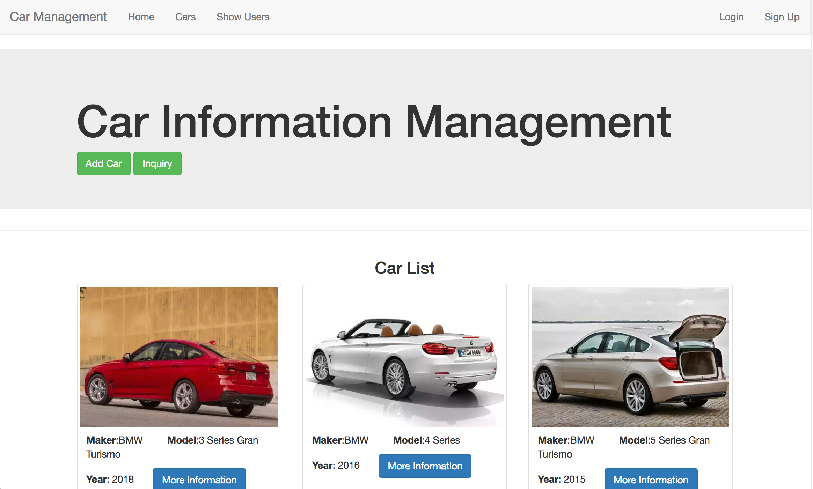
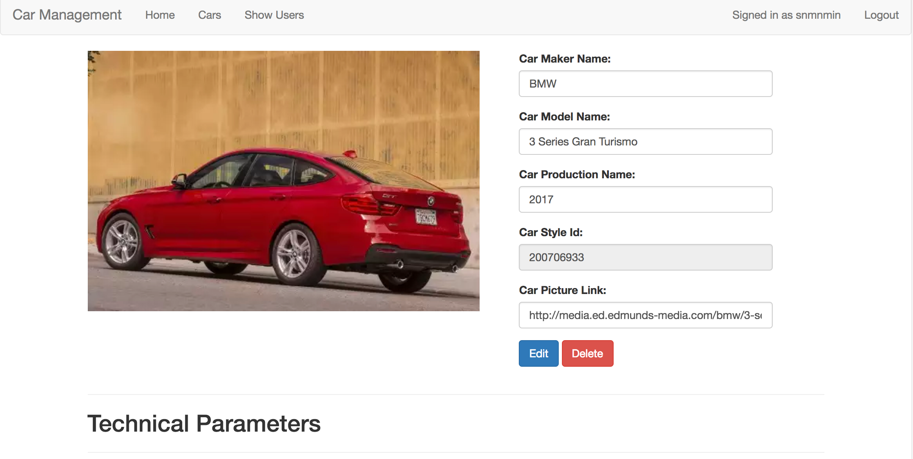
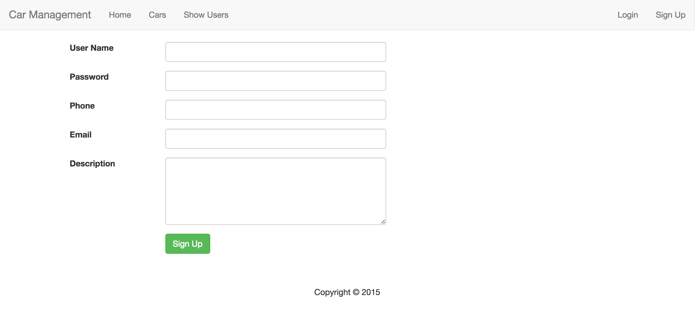

## Feature Description 
This is the screenshot for home pages to display all the products it has and some basic information. Here, the pagination is also used to go over pages one by page.




Let's go to the more information pages, by click ```More information``` buttons, it leads to a information page. Here, session is used to save the user logging information. So it will display the logged user name in the right upper corner.
In addition to that, all the technical parameters are also showed such as style, engine information.


 


User can also give comments for this particular car. All comments/reviews for the selected car are listed there with usernames and timestamp when the comments are generated.

In the log in page, user can log in to the web page.


All the information are saved in the database.

## Java Spring Implementation
The above features are implemented with Java Spring MVC framework and hibernate for database ORM. Maven is used for package management. 

All data are obtained from a famous used car website API. I used python to access the data API, cleaned the data, and then save it to the MySQL.

#### Database Design

Here, I have designed several tables to save the data in MySQL such as car, engine, style, user, review.

```SQL
CREATE TABLE `car` (
  `idcar` int(11) NOT NULL AUTO_INCREMENT,
  `modelname` varchar(45) DEFAULT NULL,
  `makename` varchar(45) DEFAULT NULL,
  `prodyear` int(11) DEFAULT NULL,
  `styleId` int(11) DEFAULT NULL,
  `picture` varchar(250) DEFAULT NULL,
  PRIMARY KEY (`idcar`)
);
CREATE TABLE `engines` (
  `engineid` int(11) NOT NULL,
  `name` varchar(100) DEFAULT NULL,
  `code` varchar(45) DEFAULT NULL,
  `comRatio` float DEFAULT NULL,
  `comType` varchar(45) DEFAULT NULL,
  `configuration` varchar(45) DEFAULT NULL,
  `cylinder` varchar(45) DEFAULT NULL,
  `displacement` float DEFAULT NULL,
  `fuelType` varchar(45) DEFAULT NULL,
  `horsePower` int(11) DEFAULT NULL,
  `rpm` int(11) DEFAULT NULL,
  `size` int(11) DEFAULT NULL,
  `type` varchar(45) DEFAULT NULL,
  PRIMARY KEY (`engineid`)
);
CREATE TABLE `styles` (
  `styleid` int(11) NOT NULL,
  `stylename` varchar(45) DEFAULT NULL,
  `numDoors` int(11) DEFAULT NULL,
  `mCode` varchar(45) DEFAULT NULL,
  `body` varchar(45) DEFAULT NULL,
  `transmission` varchar(45) DEFAULT NULL,
  `engineid` int(11) DEFAULT NULL,
  `driveWheels` varchar(45) DEFAULT NULL,
  `MPG` int(11) DEFAULT NULL,
  `trim` varchar(45) DEFAULT NULL,
  PRIMARY KEY (`styleid`)
);
CREATE TABLE `users` (
  `username` varchar(25) NOT NULL,
  `password` varchar(45) DEFAULT NULL,
  `phone` varchar(13) DEFAULT NULL,
  `email` varchar(45) DEFAULT NULL,
  `description` varchar(100) DEFAULT NULL,
  PRIMARY KEY (`username`)
);

CREATE TABLE `reviews` (
  `username` varchar(25) NOT NULL,
  `carid` int(11) NOT NULL,
  `comments` blob,
  `date` datetime NOT NULL DEFAULT CURRENT_TIMESTAMP,
  PRIMARY KEY (`username`,`carid`),
  KEY `carid_idx` (`carid`),
  CONSTRAINT `carid` FOREIGN KEY (`carid`) REFERENCES `car` (`idcar`) ON DELETE NO ACTION ON UPDATE NO ACTION,
  CONSTRAINT `username` FOREIGN KEY (`username`) REFERENCES `users` (`username`) ON DELETE CASCADE ON UPDATE NO ACTION
);
```